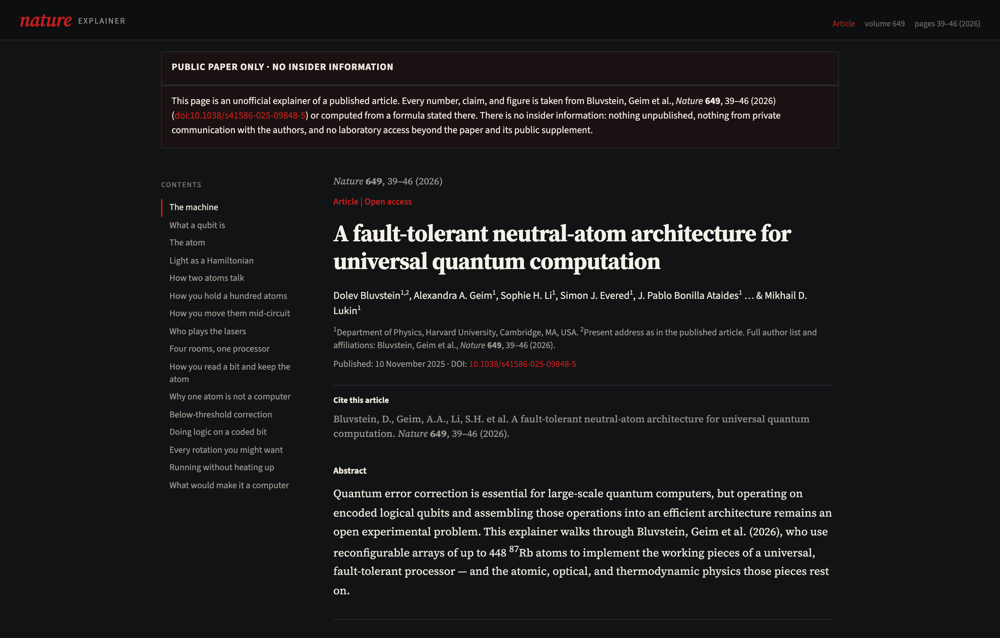
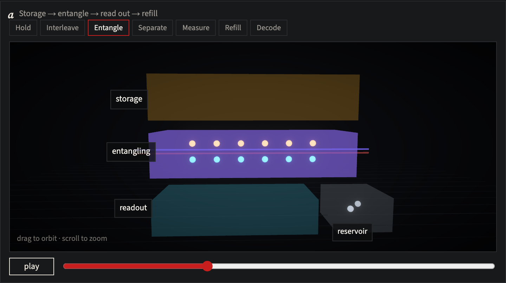
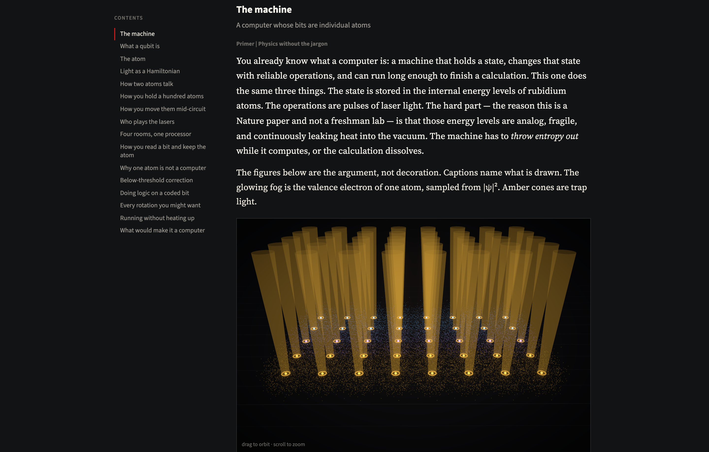
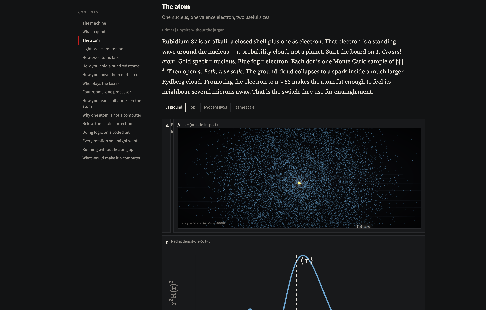

# How to build a quantum computer out of atoms

<p align="center">
  
</p>

A guide **anyone** can read to [Bluvstein, Geim et al., *Nature* **649**, 39–46 (2026)](https://doi.org/10.1038/s41586-025-09848-5) — the Harvard–MIT experiment that ran a reconfigurable array of up to **448 ⁸⁷Rb atoms** as the working pieces of a universal, fault-tolerant quantum processor.

Every chapter is written in three layers, so you choose your depth:

- **Level 1 — Plain English.** No science background assumed. Read only these boxes, top to bottom, and you will understand the whole machine.
- **Level 2 — The physics.** The actual mechanism, for the curious.
- **Level 3 — What the paper measured.** The experiment's own numbers, each tagged to a figure or Methods line.

The figures move. Every displayed number is taken from the paper or computed from a formula stated there.

[Paper](https://www.nature.com/articles/s41586-025-09848-5) · [DOI 10.1038/s41586-025-09848-5](https://doi.org/10.1038/s41586-025-09848-5)

---

## Public paper only — no insider information

This is an **unofficial** explainer of a **published** article. It is not affiliated with Springer Nature or the authors.

- Every number, claim, and figure is from Bluvstein, Geim et al., *Nature* **649**, 39–46 (2026) or from a formula in that paper or its public supplement.
- There is **no insider information**: nothing unpublished, nothing from private communication with the authors, and no laboratory access beyond the paper.

---

## Demo

<p align="center">
  
  <br />
  <em>One round of error correction as choreography — scrub the timeline or watch it play: interleave, 270 ns CZ, readout, refill from the reservoir.</em>
</p>

<p align="center">
  
  <br />
  <em>A small array of trapped ⁸⁷Rb atoms. Amber cones are 852 nm tweezers; the fog is |ψ|².</em>
</p>

<p align="center">
  
  <br />
  <em>The valence electron as a Monte Carlo sample of |ψ|², with the radial density r²R²(r).</em>
</p>

<p align="center">
  
  <br />
  <em>Rydberg blockade is a pair-state energy shift — not overlapping electron clouds.</em>
</p>

---

## What it is

A long-form article you can operate — a "dummies guide" that never dumbs down the numbers.

- **Three reading levels** in every section: plain English for everyone, the physics for the curious, and exactly what the paper measured.
- **Live figures**: 3D |ψ|² clouds, an animated Bloch sphere you drive with laser pulses, integrated two-atom blockade dynamics, a scrubbable error-correction round, SLM holograms, AOD shuttling, surface-code patches, the below-threshold bar chart, the 45° magic-state plateau.
- **Grounded claims**: 448 atoms, n = 53, 270 ns CZ, 2.14(13)× lower error at d = 5 than d = 3 on a four-round circuit — each tagged to a figure or Methods line.

Sixteen chapters, from the atom to a running fault-tolerant machine:

The machine · What a qubit is · The atom · Light is the toolbox · How two atoms talk · How you hold a hundred atoms · How you move them mid-circuit · Who plays the lasers · Four rooms, one processor · How you read a bit and keep the atom · Why one atom is not a computer · Proof that bigger is quieter · Doing logic on a coded bit · Every rotation you might want · Running without heating up · What would make it a computer

---

## Run

```bash
git clone git@github.com:luke-mcevoy/neutral-atom-compute-visualizer.git
cd neutral-atom-compute-visualizer
npm install
npm run dev
```

Opens on [http://127.0.0.1:5200/](http://127.0.0.1:5200/). Arrow keys jump between sections. Drag to orbit the 3D boards.

---

## Cite the paper

Bluvstein, D., Geim, A.A., Li, S.H. et al. A fault-tolerant neutral-atom architecture for universal quantum computation. *Nature* **649**, 39–46 (2026). https://doi.org/10.1038/s41586-025-09848-5
